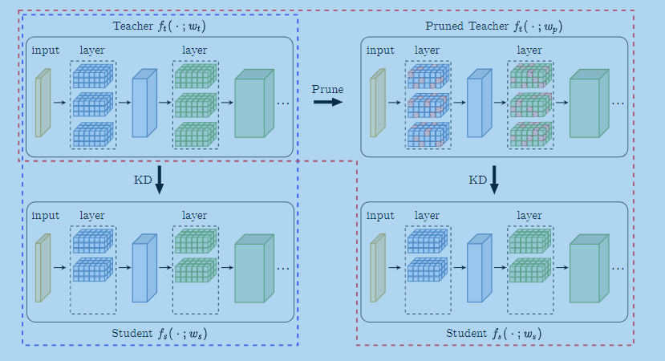

# Prune Your Model Before Distill It
> 对论文《Prune Your Model Before Distill It》相关实现 arXiv:2109.14960
> 
> 参考官方仓库 https://github.com/ososos888/prune-then-distill

## 0、Notes

> 努力改善ing

- 目前不支持训练中断后继续训练
- 没有实现加载预训练模型
- 目前仅完成剪枝，但剪枝后参数量未改变，这里应该主要是进行了mask，而没有真正意义上的删除

## 1、Prune(9.6)
> 采用pytorch官方的prune函数实现剪枝；

- 采用resnet18网络
- 采用非结构化剪枝 见pruning.py
- 对网络基本组成单元进行了重写，使其能够进行weight——mask。见models/layers.py